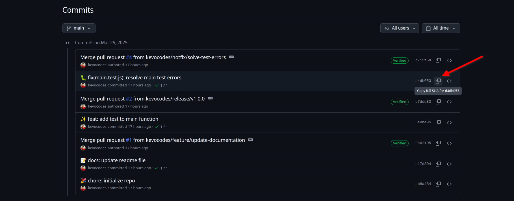

id: aca-012025-taller-2
summary: Taller 1 - Control de versioines y buenas prácticas
categories: git, version control
status: Published
authors: Metzi Aguilar, David Garcia, Erika Paz, Kevin Escobar

# Taller 2 - Control de Versiones y Buenas Prácticas con Git

<!-- ------------------------ -->

## Introducción


El control de versiones es una práctica fundamental en el desarrollo de software moderno, ya que permite a los equipos gestionar y rastrear los cambios en el código fuente a lo largo del tiempo. Git, una de las herramientas más populares para el control de versiones, ofrece una serie de funcionalidades que facilitan la colaboración entre desarrolladores, la gestión de proyectos y la recuperación de versiones anteriores del código.

Este taller tiene como objetivo proporcionar una comprensión clara de cómo utilizar Git de manera efectiva, así como las mejores prácticas para mantener un flujo de trabajo ordenado y eficiente. A lo largo de esta guía, aprenderás a inicializar un repositorio, a escribir mensajes de commit claros y significativos, y a utilizar herramientas como Commitlint, Husky y Commitizen para automatizar y estandarizar el proceso de creación de commits. Al finalizar, tendrás una base sólida para implementar un flujo de trabajo de control de versiones que mejore la calidad de tu código y la colaboración en equipo.

Además, se abordarán conceptos clave como la validación de commits, la escritura de mensajes de commit coherentes y la integración de herramientas que facilitan la adherencia a estándares de codificación. Este conocimiento no solo es valioso para el desarrollo individual, sino que también es crucial para el trabajo en equipo, donde la claridad y la consistencia son fundamentales para el éxito del proyecto.

<!-- ------------------------ -->
## Prerrequisitos

Antes de comenzar con el taller, es fundamental asegurarse de que tienes instaladas y configuradas las herramientas necesarias. A continuación, se detallan los pasos para la instalación y configuración inicial de Git y Node.js.

### Instalación de Git

Para utilizar Git, primero debes instalarlo en tu sistema. Git está disponible para múltiples plataformas, incluyendo Windows, macOS y Linux. Puedes descargarlo desde el [sitio oficial de Git](https://git-scm.com/downloads) y seguir las instrucciones de instalación específicas para tu sistema operativo. Asegúrate de que Git esté correctamente instalado ejecutando el siguiente comando en tu terminal:

```bash
git --version
```

Este comando debería mostrar la versión de Git instalada en tu sistema. Si no ves la versión, revisa el proceso de instalación.

### Instalación de Node.js

Node.js es un entorno de ejecución para JavaScript que permite ejecutar código JavaScript en el servidor. Es fundamental para el desarrollo de aplicaciones modernas, especialmente aquellas que utilizan frameworks como Express o React. Puedes descargar Node.js desde el [sitio oficial de Node.js](https://nodejs.org/) y seguir las instrucciones de instalación. Al igual que con Git, verifica que Node.js esté correctamente instalado ejecutando:

```bash
node -v
```

Este comando debería mostrar la versión de Node.js instalada en tu sistema. Si no aparece, asegúrate de que la instalación se haya completado correctamente.

<!-- ------------------------ -->

## Gitflow

Gitflow es un modelo de ramificación (branching model) que proporciona un enfoque estructurado para el desarrollo de software utilizando Git. Este flujo de trabajo es especialmente útil en proyectos que requieren un ciclo de vida de desarrollo más complejo, como aquellos que involucran múltiples versiones y lanzamientos. Gitflow ayuda a los equipos a gestionar el desarrollo de nuevas características, correcciones de errores y lanzamientos de manera organizada y eficiente.

 

### Estructura de Gitflow

El modelo Gitflow se basa en dos ramas principales y varias ramas de soporte:

1. **Rama main (o master):** Esta rama contiene el código de producción. Cada commit en esta rama representa una versión estable del software que se puede desplegar.

2. **Rama develop:** Esta rama es donde se integra el trabajo de desarrollo. Contiene las últimas características y correcciones que están listas para ser probadas antes de ser lanzadas a producción.
 
3. **Ramas de características (feature):** Se crean a partir de la rama develop para desarrollar nuevas funcionalidades. Una vez que la característica está completa, se fusiona de nuevo en develop.

4. **Ramas de corrección de errores (hotfix)**: Se crean a partir de la rama main para abordar problemas críticos en producción. Después de realizar la corrección, se fusionan tanto en main como en develop.

5. **Ramas de lanzamiento (release):** Se crean a partir de develop cuando se está listo para preparar una nueva versión. Permiten realizar pruebas finales y correcciones antes de fusionar los cambios en main.

### Flujo de Trabajo de Gitflow

A continuación, se detalla el flujo de trabajo de Gitflow, dividido en tres secciones principales: trabajo con características (features), trabajo con lanzamientos (releases) y trabajo con correcciones de errores (hotfixes).

#### 1. Trabajo con Features

El desarrollo de nuevas características se realiza a través de ramas de características (feature branches). El flujo de trabajo es el siguiente:

1. **Crear la rama `develop` a partir de `main`**: Si aún no existe, inicializa la rama `develop` a partir de `main`:

   ```bash
   git checkout main
   git checkout -b develop
   ```

2. **Acceder a `develop` y crear una rama de características**: Cuando se comienza a trabajar en una nueva característica, crea una rama de características a partir de `develop`:

   ```bash
   git checkout develop
   git checkout -b feature/nueva-caracteristica
   ```

3. **Desarrollar la característica**: Realiza los cambios necesarios en la nueva rama. Asegúrate de hacer commits regulares para mantener un historial claro.

4. **Crear la Pull Request**: Una vez que la característica está completa y probada, crea un Pull Request (PR) en la plataforma de gestión de código (como GitHub, GitLab o Bitbucket) para solicitar la revisión y fusión de la rama de características en `develop`. Esto permite que otros miembros del equipo revisen el código y realicen comentarios antes de la fusión.

5. **Fusionar la característica a `develop`**: Después de que el Pull Request ha sido revisado y aprobado, se puede fusionar en `develop`. Esto se puede hacer a través de la interfaz de la plataforma de gestión de código, lo que garantiza que se mantenga un registro claro de los cambios.

#### 2. Trabajo con Releases

El proceso de lanzamiento de nuevas versiones del software se gestiona a través de ramas de lanzamiento (release branches). El flujo de trabajo es el siguiente:

1. **Acceder a `develop`**: Asegúrate de estar en la rama `develop`:

   ```bash
   git checkout develop
   ```

2. **Crear la rama de lanzamiento a partir de `develop`**: Cuando se está listo para preparar una nueva versión, crea una rama de lanzamiento:

   ```bash
   git checkout -b release/v1.0.0
   ```

3. **Preparar el lanzamiento**: Realiza pruebas finales y correcciones en la rama de lanzamiento. Asegúrate de que todo esté listo para la producción.

4. **Crear la Pull Request para incorporar los cambios a `main`**: Una vez que el lanzamiento está listo, crea un Pull Request para fusionar la rama de lanzamiento en `main`.

5. **Fusionar el lanzamiento a `main`**: Después de que el Pull Request ha sido revisado y aprobado, se puede fusionar en `main`. Esto representa la nueva versión de producción.

6. **Etiquetar la nueva versión de producción**: Después de fusionar, etiqueta la nueva versión en `main`:

   ```bash
   git checkout main
   git tag -a v1.0.0 -m "Lanzamiento de la versión 1.0.0"
   ```

7. **Crear la Pull Request para incorporar los cambios a `develop`**: Crea un Pull Request para fusionar la rama de lanzamiento de nuevo en `develop`, asegurando que los cambios de la versión se integren en el flujo de desarrollo.

8. **Fusionar el lanzamiento a `develop`**: Después de que el Pull Request ha sido revisado y aprobado, se puede fusionar en `develop`.

#### 3. Trabajo con Ramas de Corrección de Errores

Las correcciones de errores críticos en producción se gestionan a través de ramas de corrección de errores (hotfix branches). El flujo de trabajo es el siguiente:

1. **Acceder a `main`**: Asegúrate de estar en la rama `main`:

   ```bash
   git checkout main
   ```

2. **Crear la rama de corrección de errores**: Cuando se encuentra un error crítico en producción, crea una rama de corrección de errores a partir de `main`:

   ```bash
   git checkout -b hotfix/correccion-critica
   ```

3. **Corregir los errores**: Realiza los cambios necesarios para corregir el error.

4. **Crear la Pull Request para incorporar las correcciones a `main`**: Una vez que la corrección está completa, crea un Pull Request para fusionar la rama de corrección de errores en `main`.

5. **Fusionar la corrección a `main`**: Después de que el Pull Request ha sido revisado y aprobado, se puede fusionar en `main`. Esto actualiza la versión de producción con la corrección.

6. **Etiquetar la nueva versión de producción**: Después de fusionar, etiqueta la nueva versión en `main`:

   ```bash
   git checkout main
   git tag -a v1.0.1 -m "Corrección crítica en la versión 1.0.1"
   ```

7. **Crear la Pull Request para incorporar las correcciones a `develop`**: Crea un Pull Request para fusionar la rama de corrección de errores de nuevo en `develop`, asegurando que los cambios de la corrección se integren en el flujo de desarrollo.

8. **Fusionar las correcciones a `develop`**: Después de que el Pull Request ha sido revisado y aprobado, se puede fusionar en `develop`.

<aside class="negative">
⚠️ Siempre que se cree una nueva rama de soporte, es importante realizar un <b>git pull</b> de las ramas principales correspondientes, de esta manera se evitan conflictos de sincronización de cambios.
</aside>
<!-- ------------------------ -->

## Configuración Proyecto

Para el ejercicio práctico de este taller es importante configurar tu espacio de trabajo, para ello es muy importante haber cumplido con los `prerrequisitos` de la guía.

### Inicialización de Repositorio de Git

Una vez que Git está instalado, puedes inicializar un nuevo repositorio de Git en tu proyecto. Esto se hace con el siguiente comando:

```bash
git init
```

Este comando creará un nuevo subdirectorio llamado `.git` en tu proyecto, que contendrá todos los archivos necesarios para el seguimiento de versiones. Este paso es crucial, ya que establece el contexto para todas las operaciones de control de versiones que realizarás en el futuro.

Además, es recomendable crear un archivo `.gitignore` para evitar que ciertos archivos o carpetas, como `node_modules`, se suban al repositorio. Para ello, crea un archivo llamado `.gitignore` en la raíz de tu proyecto y agrega lo siguiente:

```text
node_modules
```

Este archivo le indica a Git que ignore la carpeta `node_modules`, que puede contener una gran cantidad de archivos y no es necesario incluirla en el control de versiones. Ignorar archivos innecesarios ayuda a mantener el repositorio limpio y enfocado en el código fuente relevante.

### Inicialización de Proyecto Node

Para iniciar un nuevo proyecto de Node.js, utiliza el siguiente comando:

```bash
npm init -y
```

Este comando generará un archivo `package.json` con la configuración básica del proyecto. El output será similar al siguiente:

```text
Wrote to /project/package.json:
{
  "name": "project",
  "version": "1.0.0",
  "main": "index.js",
  "scripts": {
    "test": "echo \"Error: no test specified\" && exit 1"
  },
  "keywords": [],
  "author": "",
  "license": "ISC",
  "description": ""
}
```

A continuación, es recomendable eliminar el script de prueba y agregar el tipo de proyecto como módulo en el archivo `package.json`:

Eliminar el script de test:

```json
{
  ...
  "scripts": {},
  ...
}
```

Agregar el `type: module`:

```json
{
  ...
  "type": "module",
  ...
}
```

Con estos pasos, tu entorno estará listo para comenzar a trabajar con Git y Node.js, y podrás seguir adelante con las siguientes secciones del taller.

<!-- ------------------------ -->

## Validación de Commits

La validación de commits es una práctica importante que ayuda a mantener la calidad del código y a seguir un estándar en los mensajes de commit. A continuación, se presentan herramientas que facilitan esta tarea.

### Commitlint

Commitlint es una herramienta que permite verificar que los mensajes de commit sigan un formato específico. Esto es útil para mantener un historial de commits claro y comprensible.

#### Instalación

Para instalar Commitlint, ejecuta el siguiente comando:

```bash
npm install -D @commitlint/{cli,config-conventional}
```

<aside>ℹ️ Puedes ver las configuraciones disponibles desde el siguiente <a target="_blank" href="https://github.com/conventional-changelog/commitlint?tab=readme-ov-file#shared-configuration">enlace</a></aside>

#### Configuración

Crea el archivo `commitlint.config.js` en la raíz del proyecto y agrega el siguiente contenido:

```js
export default {
  extends: ["@commitlint/config-conventional"],
};
```

Con esta configuración, Commitlint verificará que los mensajes de commit sigan la siguiente estructura:

```bash
type(scope?): subject
body?
footer?
```

Para verificar el funcionamiento, puedes ejecutar el siguiente comando:

```bash
echo "foo: mensaje" | npx commitlint --verbose
```

El output esperado será un error indicando que el tipo no es válido:

```bash
⧗   input: foo: mensaje

✖   type must be one of [build, chore, ci, docs, feat, fix, perf, refactor, revert, style, test] [type-enum]

✖   found 1 problems, 0 warnings
ⓘ   Get help: https://github.com/conventional-changelog/commitlint/#what-is-commitlint
```

Si validamos un commit que cumpla con el estándar de conventional commits, el comando sería:

```bash
echo "feat: add new feature" | npx commitlint --verbose
```

El output esperado será el siguiente, indicando que no hay problemas:

```bash
⧗   input: feat: add new feature

✔   found 0 problems, 0 warnings
```

#### Configuración de Gitmojis (opcional)

Si deseas utilizar gitmojis en tus mensajes de commit, puedes verificar un commit que incluya gitmojis con el siguiente comando:

```bash
echo ":sparkles: feat: add new feature" | npx commitlint --verbose
```

Esto generará un error, ya que Commitlint no reconocerá el formato:

```bash
⧗   input: :sparkles: feat: add new feature

✖   subject may not be empty [subject-empty]
✖   type may not be empty [type-empty]

✖   found 2 problems, 0 warnings
ⓘ   Get help: https://github.com/conventional-changelog/commitlint/#what-is-commitlint
```

Para habilitar el soporte de gitmojis, instala el paquete de configuración de gitmoji:

```bash
npm i -D commitlint-config-gitmoji
```

Luego, actualiza el archivo `commitlint.config.js` para reemplazar la configuración convencional por la de gitmojis.

1. **Eliminar** la configuración convencional:

   ```diff
   - extends: ["@commitlint/config-conventional"]
   ```

2. **Agregar** la configuración gitmoji:

   ```diff
   + extends: ["gitmoji"]
   ```

El archivo `commitlint.config.js` quedará de la siguiente manera:

```js
export default {
  extends: ["gitmoji"],
};
```

Ahora, si ejecutas nuevamente el comando para validar el mismo commit:

```bash
echo ":sparkles: feat: add new feature" | npx commitlint --verbose
```

El resultado será que el commit no presenta errores:

```bash
⧗   input: :sparkles: feat: add new feature

✔   found 0 problems, 0 warnings
```

Esto indica que cumple correctamente con la configuración establecida, que ahora es:

```bash
:gitmoji: type(scope?): subject
body?
footer?
```

### Husky

Husky es una herramienta que permite gestionar hooks de Git, facilitando la automatización de tareas como la validación de commits.

#### Instalación

Para instalar Husky, ejecuta el siguiente comando:

```bash
npm install -D husky
```

#### Configuración

El comando de inicialización simplifica la configuración de Husky en un proyecto. Crea un script de pre-commit en `.husky/` y actualiza el script de preparación en `package.json`. Puedes modificarlo más tarde según tu flujo de trabajo.

```bash
npx husky init
```

Esto generará la siguiente estructura de carpetas y archivos necesarios para el funcionamiento de Husky:

```bash
.husky
├── _
│   ├── applypatch-msg
│   ├── commit-msg
│   ├── h
│   ├── husky.sh
│   ├── post-applypatch
│   ├── post-checkout
│   ├── post-commit
│   ├── post-merge
│   ├── post-rewrite
│   ├── pre-applypatch
│   ├── pre-auto-gc
│   ├── pre-commit
│   ├── pre-merge-commit
│   ├── prepare-commit-msg
│   ├── pre-push
│   └── pre-rebase
└── pre-commit
```

Modifica el contenido del archivo `pre-commit` para incluir lo siguiente:

```text
echo "Ejecutando pre-commit..."
echo ""
```

<aside>
ℹ️ Este script se ejecuta justo antes de realizar un commit, lo que puede ser útil para ejecutar pruebas, linter de código, etc.
</aside>

A continuación, crea el script que ejecutará Commitlint cada vez que se realice un commit para validar su contenido. Ejecuta el siguiente comando desde la raíz del proyecto:

**Linux/Mac:**

```bash
# Agregar validación de mensajes de commit al hook commit-msg
echo "npx --no -- commitlint --edit \$1" > .husky/commit-msg
```

**Windows:**

```bash
# Los usuarios de Windows deben usar ` para escapar los signos de dólar
echo "npx --no commitlint --edit `$1" > .husky/commit-msg
```

Puedes probar el hook simplemente haciendo un commit, por ejemplo:

```bash
git commit -m ":sparkles: foo: this will fail"
```

Deberías ver un resultado similar si todo ha sido configurado correctamente:

```bash
Ejecutando pre-commit...

⧗   input: :sparkles: foo: this will fail
✖   type must be one of [build, ci, docs, feat, fix, perf, refactor, revert, style, test, chore, wip] [type-enum]

✖   found 1 problems, 0 warnings
ⓘ   Get help: https://github.com/conventional-changelog/commitlint/#what-is-commitlint

husky - commit-msg script failed (code 1)
```

<!-- ------------------------ -->

## Escritura de Commits

La escritura de commits es una parte fundamental del flujo de trabajo en Git. Un buen mensaje de commit no solo describe los cambios realizados, sino que también ayuda a otros desarrolladores a entender la historia del proyecto.

### Commitizen

Commitizen es una herramienta que facilita la creación de mensajes de commit siguiendo un estándar predefinido, lo que ayuda a mantener la coherencia en el historial de commits.

#### Instalación

Para instalar Commitizen y el adaptador de conventional commits, ejecuta el siguiente comando:

```bash
npm i -D commitizen cz-conventional-changelog
```

#### Configuración

Agrega la clave `config.commitizen` en la raíz de tu archivo `package.json` y configura el adaptador a utilizar:

```json
{
  ...
  "config": {
    "commitizen": {
      "path": "./node_modules/cz-conventional-changelog"
    }
  }
}
```

Para utilizar Commitizen y escribir los commits, ejecuta el siguiente comando:

```bash
npx cz
```

Esto abrirá la interfaz de línea de comandos de Commitizen, donde primero se te pedirá que selecciones el tipo de cambio que estás realizando:

```text
cz-cli@4.3.1, cz-conventional-changelog@3.3.0

? Select the type of change that you're committing: (Use arrow keys)
❯ feat:     A new feature
  fix:      A bug fix
  docs:     Documentation only changes
  style:    Changes that do not affect the meaning of the code (white-space, formatting, missing semi-colons, etc)
  refactor: A code change that neither fixes a bug nor adds a feature
  perf:     A code change that improves performance
  test:     Adding missing tests or correcting existing tests
(Move up and down to reveal more choices)
```

Luego, se te preguntará sobre el `scope` o `alcance` del commit. Si no deseas especificar uno, simplemente presiona enter:

```text
? What is the scope of this change (e.g. component or file name): (press enter to skip)
```

A continuación, se solicitará el título del commit, que debe ser escrito en tiempo imperativo:

```text
? Write a short, imperative tense description of the change (max 88 chars):
 (0)
```

Después, tendrás la opción de proporcionar una descripción más detallada del commit:

```text
? Provide a longer description of the change: (press enter to skip)
```

Se te preguntará si hay cambios que rompen la compatibilidad:

```text
Are there any breaking changes?
```

Finalmente, se te preguntará si los cambios afectan a algún issue abierto:

```text
? Does this change affect any open issues?
```

Esto generará el commit, que será validado inmediatamente por Commitlint para asegurar que cumple con la configuración establecida.

#### Configuración de Gitmojis

Para utilizar gitmojis en Commitizen, es necesario instalar el adaptador de emojis. Ejecuta el siguiente comando:

```bash
npm i -D cz-emoji-conventional
```

Luego, modifica la configuración de Commitizen en el archivo `package.json` para incluir el uso de gitmojis:

```json
{
  ...
  "config": {
    "commitizen": {
      "path": "./node_modules/cz-emoji-conventional",
      "useGitmojis": true
    }
  }
}
```

Para verificar la correcta configuración, ejecuta el comando:

```bash
npx cz
```

Notarás que ahora, en el tipo de commit, ya se incluye el gitmoji correspondiente:

```text
cz-cli@4.3.1, cz-emoji-conventional@1.2.1

? Select the type of change that you're committing: (Use arrow keys)
❯ ✨ feat:      A new feature 
  🐛 fix:       A bug fix 
  📝 docs:      Documentation only changes 
  💄 style:     Changes that do not affect the meaning of the code (white-space, formatting, missing semi-colons, etc) 
  ♻️ refactor:  A code change that neither fixes a bug nor adds a feature 
  ⚡️ perf:      A code change that improves performance 
  ✅ test:      Adding missing tests or correcting existing tests 
(Move up and down to reveal more choices)
```

El resto de los pasos para completar el commit son exactamente los mismos que antes.

De esta manera, el flujo de trabajo para la creación y validación de commits queda estructurado de la siguiente manera:

- Se crea el commit utilizando Commitizen.
- Husky detecta que se está creando un commit y ejecuta el script `commit-msg`.
- El script `commit-msg` utiliza Commitlint para validar el mensaje del commit.
- Si el mensaje es válido, el commit se completa; de lo contrario, se muestra un error y se detiene el proceso.

Este flujo asegura que todos los commits en el proyecto sigan un formato coherente y que se mantenga la calidad del código a lo largo del tiempo.

<!-- ------------------------ -->

## Evaluación

Para completar este taller, deberás seguir cada uno de los pasos descritos en esta guía, asegurándote de que las herramientas Commitlint, Husky y Commitizen estén correctamente configuradas. La entrega se realizará a través del E-Campus de la materia y deberá incluir lo siguiente:

1. **Verificación de la Configuración**:
   - Se evaluará que Commitlint, Husky y Commitizen estén configurados adecuadamente en tu proyecto. Esto incluirá la validación de casos de prueba donde se espera que los commits fallen (por ejemplo, mensajes de commit que no sigan el formato establecido) y casos donde los commits deben ser aceptados (mensajes de commit válidos).

2. **Implementación de Gitflow**:
   - Se espera que desarrolles un flujo de trabajo de Gitflow en tu proyecto, utilizando al menos una rama de cada tipo (feature, release, hotfix) de manera correcta. Esto incluye:
     - Crear una rama de características a partir de `develop` y fusionarla a través de un Pull Request.
     - Crear una rama de lanzamiento a partir de `develop` y fusionarla a las ramas correspondientes mediante Pull Request.
     - Crear una rama de corrección de errores a partir de `main` y fusionarla a las ramas correspondientes mediante Pull Request.

3. **Gráfico de Ramas**:
   - Se evaluará el gráfico de ramas para verificar el correcto uso de las ramas, asegurando que las características salgan de `develop`, que las correcciones de errores salgan de `main`, y que las ramas de lanzamiento se creen a partir de `develop`, de igual manera que se hagan merge cada una a sus ramas correspondientes y que se creen las etiquetas necesarias.

## Entregables

1. **Enlace del Repositorio**:
   - Deberás subir tu proyecto a un repositorio público en GitHub y proporcionar el enlace del repositorio en el E-Campus para su evaluación.

2. **Hash del último commit a evaluar**:
   - Deberás identificar el último commit que has realizado en el repositorio donde desarrollaste el taller y pegarlo en la caja de texto del entregable.
   - El hash que debes copiar lo encuentras en los detalles de commits en el repositorio.
   
Asegúrate de que todos los elementos solicitados estén presentes en tu entrega para una evaluación completa.